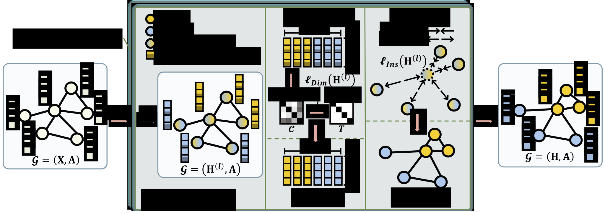

# Resisting Over-Smoothing in Graph Neural Networks via Dual-Dimensional Decoupling

**The official pytorch implementation of "Resisting Over-Smoothing in Graph Neural Networks via Dual-Dimensional Decoupling" (ACM MM 24).**

> [Resisting Over-Smoothing in Graph Neural Networks via Dual-Dimensional Decoupling]()
>
> **Abstract** Graph Neural Networks (GNNs) are widely employed to derive meaningful node representations from graphs. Despite their success, deep GNNs frequently grapple with the oversmoothing issue, where node representations become highly indistinguishable due to repeated aggregations. In this work, we consider the oversmoothing issue from two aspects of the node embedding space: dimension and instance. Specifically, while existing methods primarily concentrate on instance-level node relations to mitigate oversmoothing, we propose to mitigate oversmoothing at dimension level. We reveal the heightened information redundancy between dimensions which diminishes information diversity and impairs node differentiation in GNNs. Motivated by this insight, we propose the Dimension-Level Decoupling (DLD) to reduce dimension redundancy, enhancing dimensional-level node differentiation. Besides, at the instance level, the neglect of class differences leads to vague classification boundaries. Hence, we introduce the Instance-Level Class-Difference Decoupling (ICDD) that repels inter-class nodes and attracts intra-class nodes, improving the instance-level node discrimination with clear classification boundaries. Additionally, we introduce a novel evaluation metric that considers the impact of class differences on node distances, facilitating precise oversmoothing measurement. Extensive experiments demonstrate the effectiveness of our method Dual-Dimensional Class-Difference Decoupling (DDCD) across diverse scenarios.
